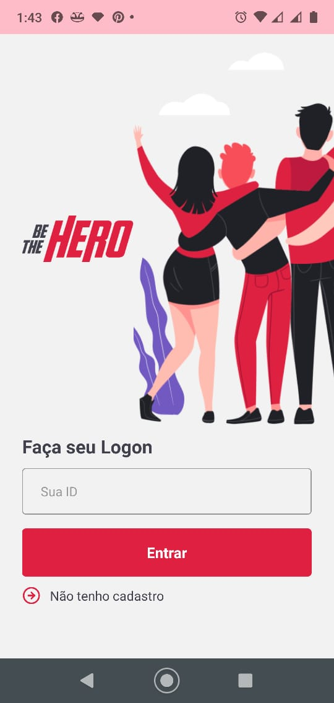
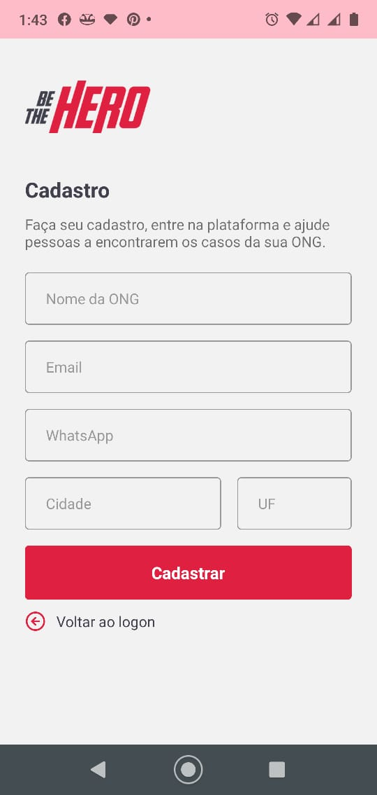
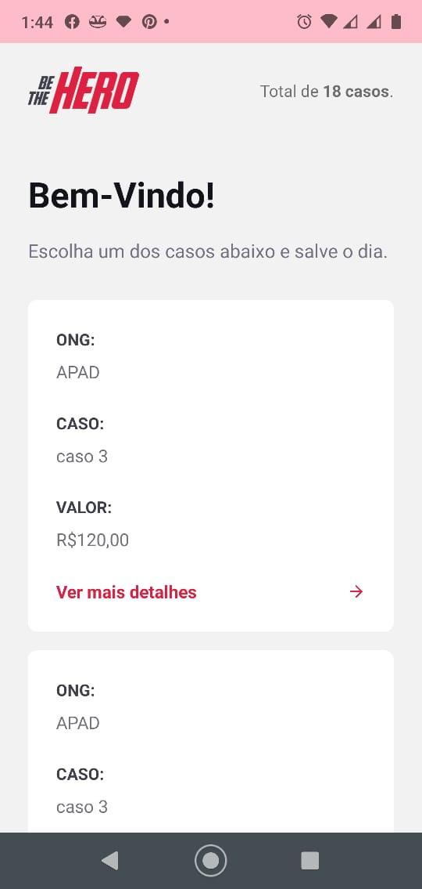
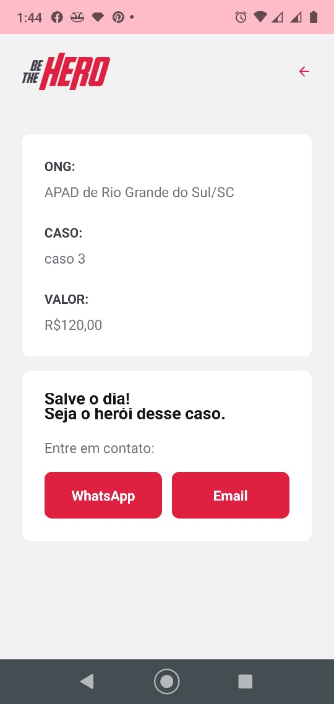

<!-- então bora codar! -->

<h1 align="center">
    
</h1>

<h3 align="center"> Aplicação para conectar ONGs e outras instituições a pessoas que tem disponibilidade para ajudar </h3>

<h3 align="center"> Criada com a stack  React,  React Native,  Node e  SQLite </h3>

  

 Usando o poder de uma stack poderosa, que utiliza de uma única linguagem popular e moderna, o  JavaScript.   Produtividade e performance de forma enxuta. 

---

A 11ª edição da Semana OmniStack, ocorrida entre 23/03 e 29/03, trouxe como projeto uma aplicação web e mobile inédita. Um sistema para conectar pessoas dispostas a ajudar a ONGs que precisam dessa ajuda.

Em uma semana foi desenvolvida uma aplicação do zero, dominando o backend, frontend e o mobile com uma única linguagem e uma única biblioteca de interfaces.

[Layout](https://www.figma.com/file/2C2yvw7jsCOGmaNUDftX9n/Be-The-Hero---OmniStack-11?node-id=0%3A1) da aplicação no  Figma.

### Primeiro dia

1. Apresentar aplicação
2. Configurar ambiente de desenvolvimento
   - Node.js & NPM
   - Visual Studio Code
3. Endenter sobre back-end & front-end
   ### Back-end
   - Regras de Negócio;
   - Conexão banco de dados;
   - Envio de e-mail;
   - Comunicação com webservices;
   - Autenticação do usuário;
   - Criptografia e segurança;
4. Criar projeto com Node.js
   - `npm install -y`
   - `npm install express`
5. Entender sobre React & SPA
6. Criar projeto com ReactJS
   - `npx create-react-app frontend`
7. Entender sobre React Native & Expo (configurei a máquina e utilizei o próprio celular para rodar)
   - `react-native init mobile`

### Quinto dia

1. Adicionando validação `npm i celebrate`

   `{`
   `BODY: 'body',`
   `COOKIES: 'cookies',`
   `HEADERS: 'headers',`
   `PARAMS: 'params',`
   `QUERY: 'query',`
   `SIGNEDCOOKIES: 'signedCookies',`
   `}`

2. Adicionando testes
   1. Por que fazer teste?
   2. TDD > Teste Driven Development
      Primeiro faz os testes, depois desenvolve
   3. Configurando Jest (Api Jest)
   4. server-side rendering `Next.js`
   5. Tipos de testes
      1. Integração: Testa por completo uma funcionalidade
      2. Unitários: Testa de um pedaço da aplicação de forma muito isolada. Não vai ter side effects
   6. Configurando banco de testes
      1. `Cross-env`
   7. Instalando supertest
      1. Faz requisições http específica para teste e traz junto algumas validações
   8. Testando rota de autenticação/criação
3. Deploy
   1. Alternativas
   2. Qual escolher?
      Heroku  Node.js e  React.js [Netlify](https://www.netlify.com/)
4. Estudos daqui pra frente
   1. Padrões de código: ESLint, Prettier
   2. Autenticação JWT
   3. Styled Components (CSS-in-JS)

## Para rodar a aplicação

> OBS: pode-se utilizar o gerenciador de pacotes npm ou o yarn para rodar os comandos abaixo

Execute `npm install` ou `yarn install` nas pastas backend, frontend e mobile, para instalar as dependências.

Rode `npm start` na pasta backend e acesse **localhost:3333**.

Rode `npm start` na pasta frontend para utilizar a versão web. Acesse via **localhost:3000**.

Para este projeto rode `react-native run-android` ou `react-native run-ios` na pasta mobile. Se caso aparecer erros, antes de rodar o 'Welcome to React', tente `npm android-clean` ou `yarn android-clean`.

## Telas

    
    
    
    
    
    
    
    
    
    
    
    

Veja também esse [vídeo](https://youtu.be/UygqW2eBJJA) com a demonstração das versões web e mobile rodando localmente.

Configuração do VSCode
[layout](https://github.com/CollabCodeTech/forum-do-front-ao-end/issues/20)
